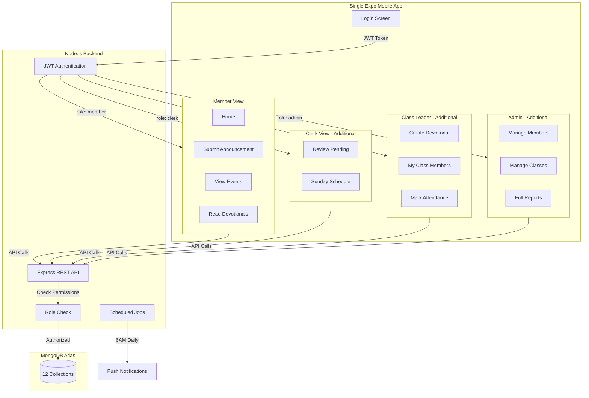
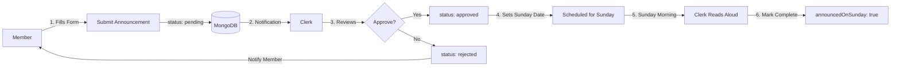
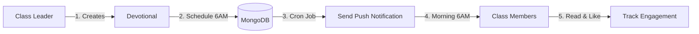
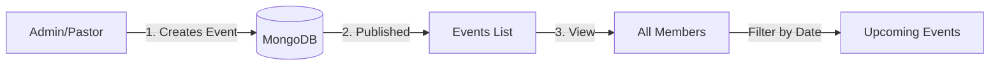

# Expo Mobile App - MongoDB Database System Plan

## Overview
Create a comprehensive MongoDB database schema for the **Methodist Community Four App** mobile app built with Expo/React Native, with MongoDB and Mongoose.

### Key Features
1. **Announcement Submission System** - Members submit announcements → Clerk reviews & approves → Clerk reads on Sunday
2. **Upcoming Events** - Members view scheduled church events
3. **Morning Devotionals** - Class leaders send daily devotionals to their class members
4. **Attendance Tracking** - Track Sunday service and Sunday School attendance
5. **Member & Class Management** - Manage church members and classes

### 📱 Single App for All Users
**ONE APP** for members, clerks, class leaders, and admins - the interface adapts based on user role. No need for separate admin app!

- **Members** see: Home, Announcements (submit), Events, Devotionals, Profile
- **Clerk** sees everything above + Pending Reviews & Sunday Schedule tabs
- **Class Leaders** see everything above + Create Devotionals & My Class management
- **Admin/Pastor** sees all features including Members, Classes, Reports, Settings

## Technology Stack
- **Frontend**: Expo (React Native) for iOS & Android
- **Database**: MongoDB Atlas (cloud-hosted)
- **ODM**: Mongoose for schema validation
- **Backend**: Node.js + Express REST API
- **Authentication**: JWT tokens with refresh tokens
- **State Management**: React Query for data fetching
- **Push Notifications**: Expo Push Notification Service
- **Offline Storage**: WatermelonDB + AsyncStorage
- **Accessibility**: react-native-tts (text-to-speech), expo-speech (voice input)

## Architecture Diagram



## Database Architecture

### Core Design Principles
1. **Denormalization for mobile performance** - Reduce joins by embedding frequently accessed data
2. **Offline-first support** - Schema designed for local caching and sync
3. **Audit trails** - Track all changes with createdAt, updatedAt, createdBy fields
4. **Soft deletes** - Use `isDeleted` flag instead of hard deletes for data recovery

---

## Key User Workflows

### 1. Announcement Submission Workflow



### 2. Morning Devotional Flow



### 3. Events Viewing Flow



---

## MongoDB Collections Schema

### 1. **users** Collection
Primary authentication and user management.

```javascript
{
  _id: ObjectId,
  email: String (unique, required, indexed),
  password: String (hashed with bcrypt),
  fullName: String (required),
  phone: String,
  profilePhoto: String (URL),
  role: String (enum: ['admin', 'pastor', 'clerk', 'class_leader', 'sunday_school_teacher', 'member']),
  isActive: Boolean (default: true),
  lastLogin: Date,
  refreshToken: String,
  createdAt: Date,
  updatedAt: Date,
  isDeleted: Boolean (default: false)
}

// Indexes
- email (unique)
- role
- isActive, isDeleted (compound)
```

**Accessibility Note**: Store user preferences like fontSize, highContrast mode here.

---

### 2. **classes** Collection
Church classes/groups management.

```javascript
{
  _id: ObjectId,
  className: String (required),
  description: String,
  leaderId: ObjectId (ref: 'users'),
  leaderName: String (denormalized for quick display),
  memberCount: Number (default: 0, updated via hooks),
  meetingDay: String (e.g., "Sunday", "Wednesday"),
  meetingTime: String,
  isActive: Boolean (default: true),
  createdAt: Date,
  updatedAt: Date,
  isDeleted: Boolean (default: false)
}

// Indexes
- leaderId
- isActive, isDeleted (compound)
- className (text index for search)
```

---

### 3. **members** Collection
Church members/attendees. Note: Members can also have user accounts for app login.

**User Account Link:** If a member has app access, link via `userId` field.

```javascript
{
  _id: ObjectId,
  userId: ObjectId (ref: 'users', optional), // Link to user account if member has app access
  fullName: String (required),
  phone: String,
  email: String,
  address: String,
  dateOfBirth: Date,
  gender: String (enum: ['male', 'female', 'other']),
  profilePhoto: String (URL),
  
  // Class Assignment
  classId: ObjectId (ref: 'classes'),
  className: String (denormalized),
  
  // Family Relationships
  familyId: ObjectId (optional, groups family members),
  relationshipType: String (e.g., "head", "spouse", "child"),
  
  // Emergency Contact
  emergencyContact: {
    name: String,
    phone: String,
    relationship: String
  },
  
  // Membership Info
  membershipDate: Date,
  membershipStatus: String (enum: ['active', 'inactive', 'visitor']),
  
  // Metadata
  notes: String,
  createdAt: Date,
  updatedAt: Date,
  createdBy: ObjectId (ref: 'users'),
  isDeleted: Boolean (default: false)
}

// Indexes
- userId (unique, sparse)
- classId
- familyId
- fullName (text index)
- phone (for quick search)
- membershipStatus, isDeleted (compound)
```

---

### 4. **attendance** Collection
Sunday service attendance records.

```javascript
{
  _id: ObjectId,
  memberId: ObjectId (ref: 'members', required),
  memberName: String (denormalized),
  classId: ObjectId (ref: 'classes'),
  className: String (denormalized),
  
  date: Date (required, indexed),
  status: String (enum: ['present', 'absent', 'late', 'excused'], default: 'present'),
  
  // Additional Info
  checkedInAt: Date,
  notes: String,
  
  // Recording Info
  recordedBy: ObjectId (ref: 'users', required),
  recordedByName: String (denormalized),
  
  createdAt: Date,
  updatedAt: Date
}

// Indexes
- memberId, date (compound unique)
- date (for date range queries)
- classId, date (compound for class reports)
- status
```

---

### 5. **sundaySchoolClasses** Collection
Sunday school class management.

```javascript
{
  _id: ObjectId,
  className: String (required),
  ageGroup: String (e.g., "3-5 years", "6-8 years", "Teens"),
  teacherId: ObjectId (ref: 'users'),
  teacherName: String (denormalized),
  assistantTeachers: [{
    userId: ObjectId (ref: 'users'),
    name: String
  }],
  studentCount: Number (default: 0),
  meetingTime: String,
  room: String,
  isActive: Boolean (default: true),
  createdAt: Date,
  updatedAt: Date,
  isDeleted: Boolean (default: false)
}

// Indexes
- teacherId
- ageGroup
- isActive, isDeleted (compound)
```

---

### 6. **sundaySchoolStudents** Collection
Sunday school students (often children of church members).

```javascript
{
  _id: ObjectId,
  fullName: String (required),
  dateOfBirth: Date,
  age: Number (calculated),
  gender: String (enum: ['male', 'female', 'other']),
  profilePhoto: String (URL),
  
  // Class Assignment
  classId: ObjectId (ref: 'sundaySchoolClasses'),
  className: String (denormalized),
  
  // Parent/Guardian Info
  parentMemberId: ObjectId (ref: 'members'),
  parentName: String,
  parentPhone: String (required),
  
  // Additional Info
  allergies: String,
  specialNeeds: String,
  notes: String,
  
  enrollmentDate: Date,
  isActive: Boolean (default: true),
  
  createdAt: Date,
  updatedAt: Date,
  createdBy: ObjectId (ref: 'users'),
  isDeleted: Boolean (default: false)
}

// Indexes
- classId
- parentMemberId
- fullName (text index)
- isActive, isDeleted (compound)
```

---

### 7. **sundaySchoolAttendance** Collection
Sunday school attendance tracking.

```javascript
{
  _id: ObjectId,
  studentId: ObjectId (ref: 'sundaySchoolStudents', required),
  studentName: String (denormalized),
  classId: ObjectId (ref: 'sundaySchoolClasses'),
  className: String (denormalized),
  
  date: Date (required, indexed),
  status: String (enum: ['present', 'absent', 'late'], default: 'present'),
  
  // Additional Info
  checkedInBy: String (parent/guardian name),
  checkedInAt: Date,
  notes: String,
  
  // Recording Info
  teacherId: ObjectId (ref: 'users', required),
  teacherName: String (denormalized),
  
  createdAt: Date,
  updatedAt: Date
}

// Indexes
- studentId, date (compound unique)
- date (for date range queries)
- classId, date (compound)
```

---

### 8. **events** Collection
Church events, services, special programs.

```javascript
{
  _id: ObjectId,
  eventName: String (required),
  description: String,
  eventType: String (enum: ['service', 'meeting', 'conference', 'social', 'other']),
  
  startDate: Date (required),
  endDate: Date,
  startTime: String,
  endTime: String,
  
  location: String,
  organizerId: ObjectId (ref: 'users'),
  organizerName: String (denormalized),
  
  expectedAttendees: Number,
  isPublic: Boolean (default: true),
  
  createdAt: Date,
  updatedAt: Date,
  createdBy: ObjectId (ref: 'users'),
  isDeleted: Boolean (default: false)
}

// Indexes
- startDate
- eventType
- isPublic, isDeleted (compound)
```

---

### 9. **announcements** Collection
Member-submitted announcements with clerk approval workflow.

```javascript
{
  _id: ObjectId,
  title: String (required),
  message: String (required),
  
  // Submission Info
  submittedBy: ObjectId (ref: 'members', required),
  submittedByName: String (denormalized),
  submittedByPhone: String (denormalized),
  submittedAt: Date (default: now),
  
  // Approval Workflow
  status: String (enum: ['pending', 'approved', 'rejected'], default: 'pending'),
  reviewedBy: ObjectId (ref: 'users'), // Clerk/Admin
  reviewedByName: String (denormalized),
  reviewedAt: Date,
  rejectionReason: String,
  
  // Publishing (after approval)
  publishDate: Date, // Sunday to be announced
  announcedOnSunday: Boolean (default: false),
  announcedAt: Date,
  
  priority: String (enum: ['low', 'normal', 'high', 'urgent'], default: 'normal'),
  category: String (enum: ['general', 'prayer_request', 'thanksgiving', 'event', 'other']),
  
  // Visibility
  isPublic: Boolean (default: true),
  
  createdAt: Date,
  updatedAt: Date,
  isDeleted: Boolean (default: false)
}

// Indexes
- status, submittedAt (compound)
- publishDate, status (compound)
- submittedBy
- reviewedBy
```

**Workflow:**
1. Member fills form → submits announcement (status: 'pending')
2. Clerk views pending announcements
3. Clerk approves/rejects → sets publishDate (Sunday date)
4. On Sunday: Clerk reads approved announcements
5. After reading: Mark as `announcedOnSunday: true`

---

### 10. **devotionals** Collection
Daily devotionals from class leaders to their class members.

```javascript
{
  _id: ObjectId,
  title: String (required),
  content: String (required), // The devotional message
  scripture: String, // Bible verse reference (e.g., "John 3:16")
  
  // Author Info
  authorId: ObjectId (ref: 'users', required), // Class leader
  authorName: String (denormalized),
  authorRole: String (denormalized),
  
  // Class Targeting
  classId: ObjectId (ref: 'classes', required),
  className: String (denormalized),
  
  // Delivery
  deliveryDate: Date (required, indexed), // Date to be sent
  deliveryTime: String (e.g., "06:00 AM"), // Morning time
  sentAt: Date, // Actual sent timestamp
  
  // Recipients tracking (for read receipts)
  recipients: [{
    memberId: ObjectId (ref: 'members'),
    memberName: String,
    readAt: Date,
    liked: Boolean (default: false)
  }],
  
  // Stats
  totalRecipients: Number,
  totalRead: Number (default: 0),
  totalLikes: Number (default: 0),
  
  // Media
  imageUrl: String, // Optional devotional image
  audioUrl: String, // Optional audio version for accessibility
  
  isActive: Boolean (default: true),
  createdAt: Date,
  updatedAt: Date,
  isDeleted: Boolean (default: false)
}

// Indexes
- classId, deliveryDate (compound)
- authorId, deliveryDate (compound)
- deliveryDate (for scheduled sending)
```

**Features:**
- Class leaders create devotionals for their class
- Schedule for morning delivery (6:00 AM)
- Members receive push notification
- Track read status and likes
- Audio option for older users who prefer listening

---

### 11. **reports** Collection
Pre-generated reports for quick access.

```javascript
{
  _id: ObjectId,
  reportType: String (enum: ['weekly_attendance', 'monthly_summary', 'class_growth', 'ss_attendance']),
  reportPeriod: {
    startDate: Date,
    endDate: Date
  },
  
  // Report Data (JSON blob)
  data: Object,
  
  generatedBy: ObjectId (ref: 'users'),
  generatedAt: Date,
  
  createdAt: Date
}

// Indexes
- reportType, generatedAt (compound)
- reportPeriod.startDate, reportPeriod.endDate (compound)
```

---

### 12. **auditLogs** Collection
Track all critical actions for security and accountability.

```javascript
{
  _id: ObjectId,
  userId: ObjectId (ref: 'users'),
  userName: String (denormalized),
  action: String (e.g., "CREATE_MEMBER", "DELETE_ATTENDANCE", "UPDATE_CLASS"),
  resourceType: String (e.g., "member", "attendance", "class"),
  resourceId: ObjectId,
  
  // Change Details
  changes: {
    before: Object,
    after: Object
  },
  
  ipAddress: String,
  deviceInfo: String,
  timestamp: Date (indexed),
  
  createdAt: Date
}

// Indexes
- userId, timestamp (compound)
- resourceType, resourceId (compound)
- timestamp (for time-based queries)
```

---

## Mobile App Accessibility Features for Older Users

### UI/UX Design Principles

1. **Large Touch Targets**
   - Minimum button height: 60px
   - Spacing between interactive elements: 16px
   - Large, clear icons with labels

2. **Typography**
   - Base font size: 18px (configurable up to 24px)
   - High contrast: WCAG AAA compliance
   - Sans-serif fonts (Arial, Roboto)
   - Increased line height: 1.6

3. **Simplified Navigation**
   - Bottom tab navigation (adaptive based on role)
   - Tabs shown/hidden based on user permissions
   - Badge counters for pending items (clerk sees pending announcements count)
   - Clear back buttons on every screen
   - Breadcrumb navigation where appropriate
   - Minimal nested screens (max 3 levels deep)

4. **Forms & Input (Announcement Submission)**
   - **Step-by-step form** (multi-screen approach):
     * Screen 1: "What would you like to announce?" (Title field)
     * Screen 2: "Tell us more details" (Message text area)
     * Screen 3: "Choose category" (Prayer, Event, Thanksgiving, etc.)
     * Screen 4: "Review & Submit" (Confirmation screen)
   - Large input fields (60px height)
   - Clear labels above fields
   - Voice input support for text fields
   - Character counter for messages
   - Large "Submit" button with confirmation

5. **Visual Design**
   - High contrast mode toggle
   - Dark mode support
   - Clear visual feedback for all actions
   - Loading states with progress indicators
   - Success/error messages with icons and text

6. **Help & Guidance**
   - Contextual help tooltips
   - Tutorial mode on first launch:
     * How to submit an announcement
     * How to view events
     * How to read devotionals
   - Quick help button accessible from all screens
   - Video tutorials for common tasks
   - "Call Church Office" button for immediate help

---

## Backend API Architecture

### REST API Endpoints Structure

```
/api/v1
├── /auth
│   ├── POST /register
│   ├── POST /login
│   ├── POST /refresh-token
│   └── POST /logout
│
├── /users
│   ├── GET /me
│   ├── PUT /me
│   └── GET /:id (admin only)
│
├── /members
│   ├── GET / (paginated, searchable)
│   ├── GET /:id
│   ├── POST / (create)
│   ├── PUT /:id
│   └── DELETE /:id (soft delete)
│
├── /classes
│   ├── GET / (with member counts)
│   ├── GET /:id/members
│   ├── POST /
│   ├── PUT /:id
│   └── DELETE /:id
│
├── /attendance
│   ├── GET / (filter by date, class)
│   ├── POST /bulk (batch create)
│   ├── PUT /:id
│   └── GET /summary (date range stats)
│
├── /sunday-school
│   ├── /classes (CRUD)
│   ├── /students (CRUD)
│   └── /attendance (CRUD + bulk)
│
├── /events
│   └── CRUD operations
│
├── /announcements
│   ├── POST / (member submits)
│   ├── GET /pending (clerk views pending)
│   ├── GET /approved (view approved for Sunday)
│   ├── PUT /:id/approve (clerk approves)
│   ├── PUT /:id/reject (clerk rejects)
│   ├── PUT /:id/mark-announced (mark as read on Sunday)
│   └── GET /my-submissions (member's submissions)
│
├── /devotionals
│   ├── GET / (class leader's devotionals)
│   ├── GET /my-class (member receives from their class)
│   ├── POST / (class leader creates)
│   ├── PUT /:id
│   ├── DELETE /:id
│   ├── PUT /:id/mark-read (member marks as read)
│   └── PUT /:id/like (member likes)
│
└── /reports
    ├── GET /weekly-attendance
    ├── GET /monthly-summary
    └── GET /class-growth
```

---

## Data Validation & Business Rules

### Mongoose Schema Validation

1. **Required Fields**: Enforce at schema level
2. **Enums**: Use strict enum validation for status fields
3. **Phone Numbers**: Format validation (E.164 format)
4. **Email**: RFC 5322 validation
5. **Dates**: Validate date ranges (e.g., birth dates in past)

### Business Logic Hooks

```javascript
// Pre-save hooks
- Hash passwords before saving users
- Calculate age from dateOfBirth for students
- Update memberCount when member added to class
- Set default role for new users

// Post-save hooks
- Create audit log entries
- Update denormalized fields in related collections
- Trigger notifications

// Pre-delete hooks (soft delete)
- Set isDeleted flag
- Archive related attendance records
```

---

## Performance Optimizations

1. **Indexes**: Strategic indexes on frequently queried fields
2. **Denormalization**: Store frequently accessed names to avoid joins
3. **Pagination**: All list endpoints use cursor-based pagination
4. **Caching**: Redis for session data and frequently accessed reports
5. **Aggregation Pipeline**: Pre-compute statistics for dashboard
6. **Connection Pooling**: MongoDB connection pool for API

---

## Security Measures

1. **Authentication**: JWT with 15-minute access tokens, 7-day refresh tokens
2. **Authorization**: Role-based access control (RBAC)
   - API endpoints check user role before allowing access
   - Frontend hides/shows features based on role
   - Backend always validates permissions (never trust frontend)
3. **Password Policy**: Minimum 8 characters, bcrypt with 12 rounds
4. **Rate Limiting**: API rate limits per user/IP
5. **Input Sanitization**: Prevent NoSQL injection
6. **HTTPS Only**: All API communication encrypted
7. **Data Encryption**: Encrypt sensitive fields at rest

### Role Permission Matrix

| Feature | Member | Clerk | Class Leader | Admin/Pastor |
|---------|--------|-------|--------------|--------------|
| Submit Announcement | ✅ | ✅ | ✅ | ✅ |
| Review Announcements | ❌ | ✅ | ❌ | ✅ |
| View Events | ✅ | ✅ | ✅ | ✅ |
| Create Events | ❌ | ❌ | ❌ | ✅ |
| Read Devotionals | ✅ | ✅ | ✅ | ✅ |
| Create Devotionals | ❌ | ❌ | ✅ (own class) | ✅ (all) |
| View Own Class | ❌ | ❌ | ✅ | ✅ |
| Manage All Members | ❌ | ❌ | ❌ | ✅ |
| Mark Attendance | ❌ | ❌ | ✅ (own class) | ✅ (all) |
| View Reports | ❌ | ✅ (limited) | ✅ (own class) | ✅ (all) |

---

## Offline Support Strategy

1. **Local Storage**: Use React Native AsyncStorage + WatermelonDB
2. **Sync Queue**: Queue offline actions for server sync
3. **Conflict Resolution**: Last-write-wins with timestamps
4. **Read-only Offline**: Allow viewing data offline
5. **Smart Sync**: Sync only changed data, not full collections

---

## Migration from Supabase

Since this is a new mobile app (not converting the web app), no migration needed. However, if data needs to be migrated later:

1. Export Supabase data to JSON
2. Transform to MongoDB schema format
3. Bulk import using MongoDB import tools
4. Verify data integrity with validation scripts

---

## Additional Features & Considerations

### Push Notifications
- **Morning Devotionals**: Send at 6:00 AM daily
- **Event Reminders**: 24 hours before event, 1 hour before event
- **Announcement Status**: Notify member when clerk approves/rejects
- Use **Expo Push Notifications** service

### Accessibility Features for Older Users
1. **Text-to-Speech** - Read announcements and devotionals aloud
2. **Voice Input** - Dictate announcements instead of typing
3. **Large Buttons** - All interactive elements minimum 60px
4. **Simple Language** - Clear, concise labels (no jargon)
5. **Tutorial Videos** - Short video guides for each feature
6. **Emergency Contact** - Quick call church office button
7. **Offline Mode** - View previously loaded content offline

### Admin/Clerk Specific Features (In Same App)
- **Pending Announcements Counter** - Badge showing count on tab
- **Quick Approve/Reject** - Swipe gestures for fast review
- **Schedule Calendar** - Assign announcements to Sunday dates
- **Member Contact** - Call/message member about announcement
- **Role Indicator** - Clear badge showing "Clerk" or "Admin" in profile

### Example: Announcement Screen Adapts by Role

**For Regular Member:**
- Button: "Submit New Announcement"
- Tab: "My Submissions" (their own submissions only)

**For Clerk (Same Screen):**
- Button: "Submit New Announcement"
- Tab: "My Submissions"
- Tab: **"Pending Reviews"** (all pending submissions) ← EXTRA
- Tab: **"Sunday Schedule"** (approved for this week) ← EXTRA

---

## Development Approach

### Phase 1: Core Setup
- Initialize Expo project with TypeScript
- Set up MongoDB Atlas cluster
- Create Express API with Mongoose schemas
- Implement authentication (JWT)

### Phase 2: Member-Facing Features (Priority)
- **Announcement submission form** (large, simple form)
- **View upcoming events** (calendar view)
- **Morning devotionals feed** (from class leader)
- Member authentication & profile

### Phase 3: Admin Features
- Members CRUD
- Classes CRUD
- Attendance tracking
- Announcement approval workflow (for Clerk)

### Phase 4: Extended Features
- Sunday School functionality
- Dashboard with statistics
- Reports generation
- Push notifications for devotionals

### Phase 4: Accessibility & Polish
- Implement large UI components
- High contrast mode
- Voice input
- Tutorial system

### Phase 5: Testing & Deployment
- Unit tests for API
- Integration tests
- Beta testing with target users
- App Store / Play Store submission
